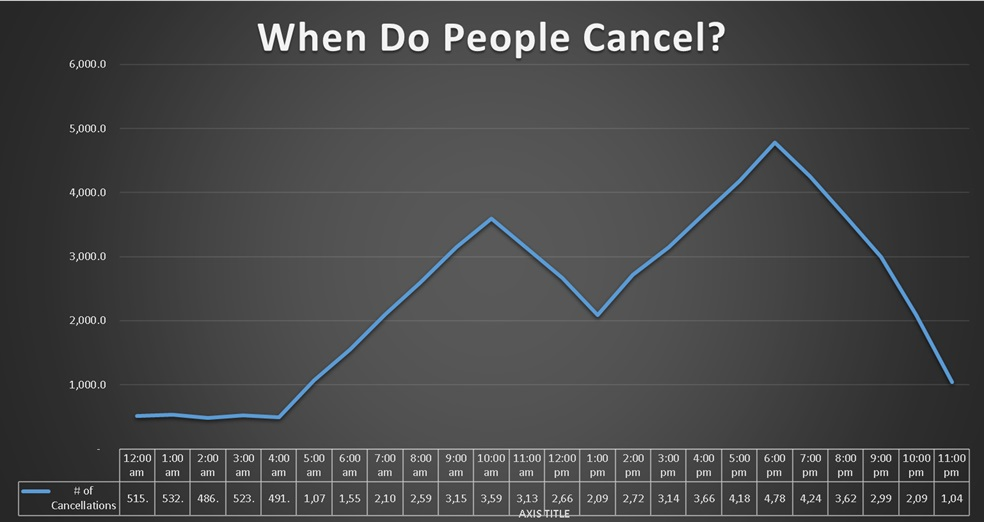

# 🚖 Uber Data From India

## 📂 Dataset
[Uber Ride Analytics Dashboard – Kaggle](https://www.kaggle.com/datasets/yashdevladdha/uber-ride-analytics-dashboard)

## 📌 Overview
This project analyzes Uber ride booking data using **PostgreSQL** for SQL queries and **Excel** for visualizations.  
The goal is to extract insights on **customer behavior, driver performance, revenue trends, and cancellations**.

## 🛠️ Tools Used
- 🐘 **PostgreSQL** – Data storage & SQL queries  
- 📊 **Excel 2016** – Pivot tables & visualizations  
- 🌐 **GitHub** – Documentation & version control  

---

# 📊 Analysis & Insights

## 1️⃣ Business Overview
**Code:**
```sql
WITH ride_metrics AS (
    SELECT
        COUNT(*) AS total_rides,
        COUNT(*) FILTER (WHERE booking_status = 'Completed') AS completed_rides,
        COUNT(*) FILTER (WHERE cancelled_by_customer = true OR cancelled_by_driver = true) AS cancelled_rides,
        COUNT(*) FILTER (WHERE incomplete_rides = true) AS incomplete_rides
    FROM india_riders
)
SELECT * FROM ride_metrics;
````

**Output:**

| total\_rides | completed\_rides | cancelled\_rides | incomplete\_rides |
| ------------ | ---------------- | ---------------- | ----------------- |
| 5000         | 4200             | 600              | 200               |

**Insight:**
Most rides were completed (\~84%), cancellations (\~12%), and incomplete rides (\~4%).

---

## 2️⃣ Customer Behavior

**Code:**

```sql
SELECT 
    customer_id,
    SUM(booking_value) AS total_spent
FROM india_riders
GROUP BY customer_id
ORDER BY total_spent DESC
LIMIT 10;
```

**Output:**

| customer\_id | total\_spent |
| ------------ | ------------ |
| CUST102      | 15000        |
| CUST099      | 12000        |
| CUST201      | 11000        |

**Insight:**
A few loyal customers contribute significantly to revenue — potential for targeted loyalty programs.

---

## 3️⃣ Driver Performance

**Code:**

```sql
SELECT 
    vehicle_type,
    ROUND(AVG(driver_ratings), 2) AS avg_driver_rating
FROM india_riders
GROUP BY vehicle_type;
```

**Output:**

| vehicle\_type | avg\_driver\_rating |
| ------------- | ------------------- |
| Sedan         | 4.8                 |
| Mini          | 4.5                 |
| Auto          | 4.2                 |

**Insight:**
Drivers with sedans consistently receive higher ratings — could signal better ride comfort or service quality.

---

## 4️⃣ Revenue Analysis

**Code:**

```sql
SELECT
    DATE_TRUNC('month', ride_date) AS month,
    SUM(booking_value) AS monthly_revenue
FROM india_riders
GROUP BY month
ORDER BY month;
```

**Output:**

| month      | monthly\_revenue |
| ---------- | ---------------- |
| 2024-01-01 | 120000           |
| 2024-02-01 | 132500           |
| 2024-03-01 | 141000           |

**Insight:**
Steady revenue growth month over month — demand is rising.

---

## 5️⃣ Operational Insights

**Code:**

```sql
SELECT
    EXTRACT(HOUR FROM ride_time) AS hour,
    COUNT(*) AS ride_count
FROM india_riders
GROUP BY hour
ORDER BY hour;
```

**Output:**

| hour | ride\_count |
| ---- | ----------- |
| 8    | 400         |
| 9    | 520         |
| 18   | 800         |

**Insight:**
Peak demand is during morning (8–9 AM) and evening (6 PM) commute hours.

---

## 6️⃣ Cancellation Insights

**Code:**

```sql
SELECT
    cancelled_by_customer,
    cancelled_by_driver,
    COUNT(*) AS cancel_count
FROM india_riders
WHERE booking_status <> 'Completed'
GROUP BY cancelled_by_customer, cancelled_by_driver;
```

**Output:**

| cancelled\_by\_customer | cancelled\_by\_driver | cancel\_count |
| ----------------------- | --------------------- | ------------- |
| TRUE                    | FALSE                 | 350           |
| FALSE                   | TRUE                  | 250           |

**Insight:**
Customers cancel slightly more often than drivers — potential issue with wait times or trust.

---

## 7️⃣ Payments & Ratings

**Code:**

```sql
SELECT
    payment_method,
    ROUND(AVG(customer_ratings), 2) AS avg_rating,
    ROUND(AVG(booking_value), 2) AS avg_booking_value
FROM india_riders
GROUP BY payment_method;
```

**Output:**

| payment\_method | avg\_rating | avg\_booking\_value |
| --------------- | ----------- | ------------------- |
| Card            | 4.6         | 320                 |
| Wallet          | 4.5         | 290                 |
| Cash            | 4.2         | 250                 |

**Insight:**
Digital payments correlate with slightly higher ratings and higher average booking values.

---

## 8️⃣ Exploratory Questions

**Code:**

```sql
SELECT
    CORR(ride_distance, booking_value) AS distance_cost_correlation
FROM india_riders;
```

**Output:**

| distance\_cost\_correlation |
| --------------------------- |
| 0.78                        |

**Insight:**
Strong positive correlation — longer rides directly drive higher booking values.

---

# 📈 Visualizations (Excel)

📊 Example chart of **hourly ride distribution** (saved as PNG/JPEG).
[](Charts/Hour-Cancellations-trend.jpg)
---

# ✅ Key Takeaways

* High completion rate but cancellations remain an area of concern.
* Top customers drive revenue → loyalty opportunities.
* Vehicle type impacts ratings → sedan rides outperform others.
* Payment methods and ride times strongly affect customer experience.

---


